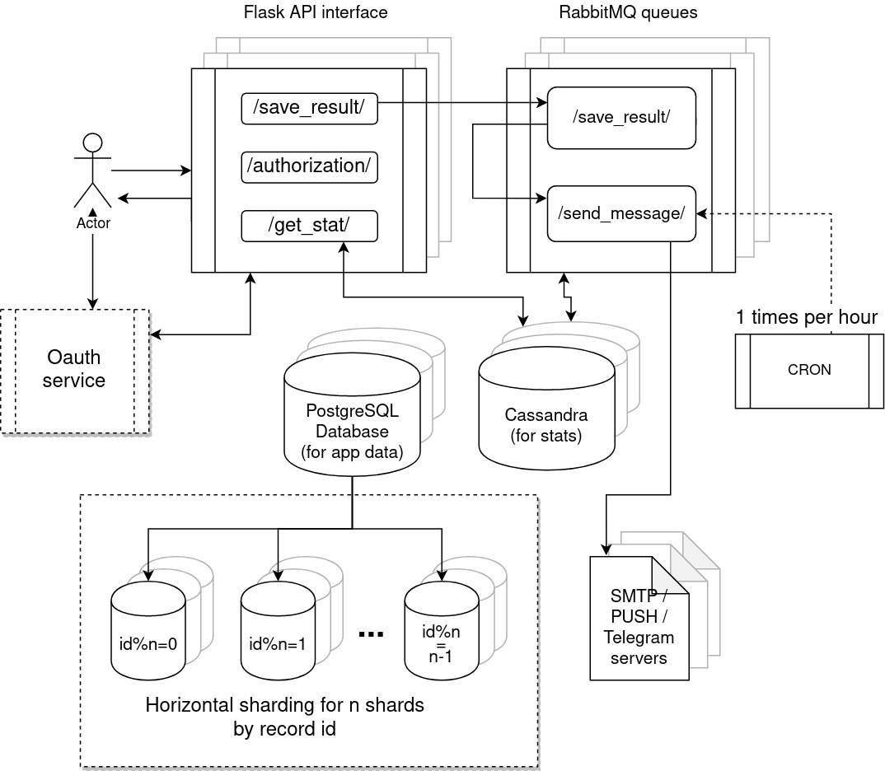

# Тестовое задание для VisionLabs

Текст задач вы можете посмотреть [здесь](Тестовое_задание_для_собеседования_Python_VL_v2.pdf)

### Задание 1
Сделано в виде [Jupyter Notebook-а](task1.ipynb) для удобства запуска и 
редактирования и в виде обычного запускаемого питоновского [файла](task1.py) 
для удобства просмотра в GitHub

Выполнена рекурсивная функция, сравнивающая два словаря.
Предполагается что JSON из строки распарсен и помещен в словарь.
При этом сравнение массивов внутри JSONа реализовано по логике такого 
сравнения в питоне при помощи оператора ==, т.е. при несоответствии 
порядка элементов в массивах они будут не равны:

    >>> [1,2,3] == [1,2,3]
    True
    >>> [1,2,3] == [3,2,1]
    False

### Задание 2
Сделано в виде запускаемого скрипта [upload.py](upload.py)
В нём жестко прописан адрес сервера, т.к. не было задачи его передавать
в параметрах командной строки.
В параметрах запуска передаётся путь до папки и количество потоков 
на закачку:

    (dl) [user@mycomp visionlabs]$ python ./upload.py --help
    usage: starter [-h] [--threads THREADS] --dir DIR
    
    optional arguments:
      -h, --help         show this help message and exit
      --threads THREADS  Number of uploading threads (default: 10)
      --dir DIR          Directory to upload files from. (default: None)
    (dl) [user@mycomp visionlabs]$ 

      
      
### Задача 3
Сделано в виде [Jupyter Notebook-а](task3.ipynb) для удобства запуска и 
редактирования и в виде обычного запускаемого питоновского [файла](task3.py) 
для удобства просмотра в GitHub

Решение задачи - создание декоратора, в который оборачивают функции 
необходимые для профилирования. Декоратор замеряет время выполнения функции 
и сбрасывает тайминг в журнал. Также в журнал сбрасывается имя декоратора
по которому можно отследить статистику по нужному участку кода. 
Все тайминги отсылаются декоратором в систему мониторинга Graphite,
используя UDP, чтобы не блокировать выполнение программы I/O вызовом.

Аналогично можно написать и менеджер контекста, который будет мерять 
участок кода с помощью оператора with, но я не сосредотачивался на 
такой реализации.

На выходе мы получаем график в системе мониторинга, который отображает
статистику по времени выполнения за выбраный период, в реальном времени.

### Задача 4

Исходя из задачи возможности неограниченого масштабирования сервиса,
а также исходя из возможности хранения большого количества данных 
по запросам о результатах и возможности выполнения тяжелых процедур,
я спроектировал прототип архитектуры на основе 
стека Flask\PostgreSQL\Cassandra\RabbitMQ\Oauth + любой SMTP сервер, который может
быть заменён на сторонний сервис отправки сообщений включая сообщения
в мессенджеры, PUSH сообщения и СМС.
Для PostgreSQL используем шардинг, чтоб он выдерживал большие нагрузки.
У Cassandra шардинг работает из коробки.

 

Начну с самого API. Его URL /authorization/ направляет пользователя на 
аутентификацию через Oauth, поэтому мы можем использовать и сторонние
сервисы типи Гугл или фейсбук, но можем поднять и свой.
Далее есть два основных URL - это /save_request/ и /get_stat/. 

Запрос /save_request/ кроме непосредственно сохранения данных 
предполагает также некоторую обработку входящих данных, которая может 
быть довольно тяжелой, в зависимости от того что считается за 
"сравнение уровней красного цвета" - это может быть и сравнение скаляров,
и сравнение крупных векторов признаков, сгенерированных классификатором.
Также может быть тяжелой функция отправки сообщения, в связи с ожиданием 
ответа сторонних сервисов. Поэтому я решил, что запрос /save_request/ 
будет просто складывать данные от сервиса RED в очередь RabbitMQ и завершать
соединение. Очередь будет разбираться множеством обработчиков, которые
возможно быстро распределить по любому количеству серверов. 
Таким образом мы можем масштабировать и API и обработку данных.

Данные от /save_request/ уходят в обработчики очереди с аналогичным
именем /save_request/. Обработчик выполняет процедуру сравнения уровня
красного цвета с некоторым эталоном заданным пользователем и хранящимся
в БД. Данная процедура, как уже указано, может быть тяжелой, кромет того
использование обработчика позволит далее добавлять в процесс больше 
кода с различной степенью "тяжести". 

История замеров красного цвета хранится в Cassandra, т.к. эта БД
хорошо оптимизирована под храненеие статистических данных и запрос к ним.
Обработчик выполняет сохранение замера в эту БД.

Далее обработчик сохранения результата, после отправки данных в БД и 
"сравнения уровня цвета", при выработки команды на отправку сообщения
добавляет команду на отправку вместе с текстом в очередь /send_email/,
которая в свою очередь может быть расширена функционалом отправки других
типов сообщений, например PUSH, СМС или сообщением от бота.

Решение об отправке сообщения принимается следующим образом. В основной БД 
хранится время последней отправки сообщения, время последнего срабатывания
порога, значение при этом срабатывании, и флаг отправки сообщения (обнуляется
при каждом прикапывании сработанного порога и устанавливается при отправке сообщения). 
Также хранится настраеваемый параметр переодичности 
отправки сообщения с интервалом по часам. Он может настраиваться на уровне всего 
приложения, а можно его сделать настраеваемым для каждого пользователя персонально.
Если разница между временем последнего срабатывания и последней отправки 
сообщения больше этого порога, то отправляем сообщение немедленно. И включаем
флаг что сообщение отправлено.

Иначе, е нас есть крон джоб, срабатывающий каждый час. Он отбирает тех юзеров,
у которых разница между текущим временем и временем последнего срабатывания 
порога больше установленного значения, а также обнулён флаг отправки 
сообщения. Таким образом мы избавимся от случаев, когда порог у юзера 
срабатывает нерегулярно, чтоб сообщение за настроенный период приходили
гарантированно.

На этом запрос /save_request/ заканчивает свой цикл работы.

Далее следует рассмотреть запрос /get_stat/. Он может быть очень
тяжелым, так как запускает выборку из потенциально большого числа 
записей о замерах от сервиса RED. Данный сервис будет просто выполнять
запрос к БД и возвращать данные. Однако чтоб сама БД смогла работать
с такими данными нужно в данном случае использовать кластер БД Cassandra 
настроенным на использование порядкового разметчика для эффективного 
выполнения запросов по временному периоду. Такой инструмент будет работать
с запросами к статистике за период более эффективно чем обычная 
реляционная БД.

-----
Предложенная архитертура позволяет неограниченно масштабировать 
каждый компонент, позволяя подключать больше ресурсов и обрабатывать
больше данных.
